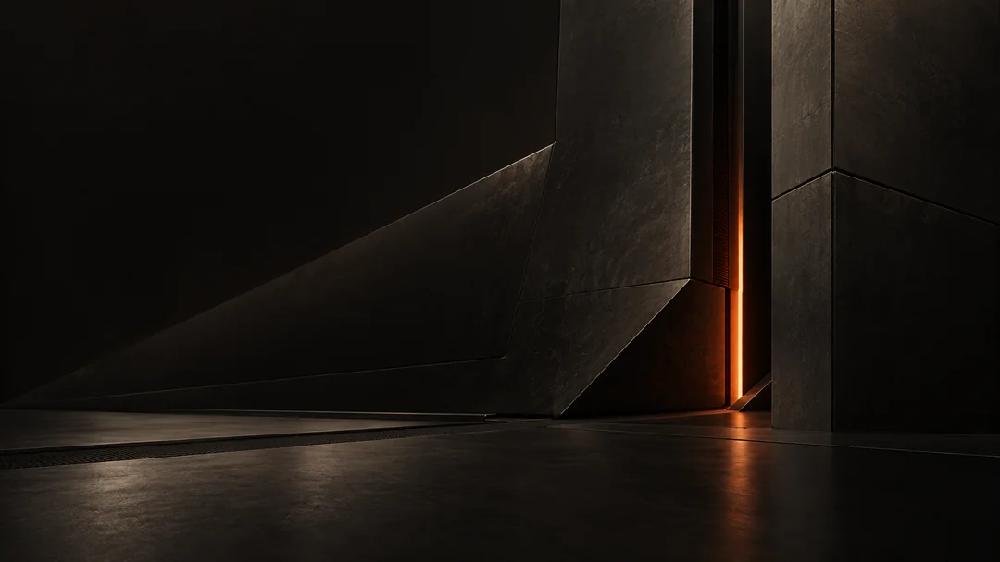

<p align="center">
  
</p>

# ATLAS showcase

**Carbon surfaces. Warm ivory text. Signal orange.**

The interactive showcase for ATLAS, an appearance bundle for Omarchy.

**[Explore ATLAS ↗](https://xrefor.github.io/atlas-showcase/)**

[](https://xrefor.github.io/atlas-showcase/)

This repository contains the website and its media. The public
[theme repository](https://github.com/xrefor/omarchy-atlas-theme) contains the
installation guide, technical documentation, and
[release downloads](https://github.com/xrefor/omarchy-atlas-theme/releases).

The demo shows the desktop, opening Python in Neovim, file browsing, and a brief
NymVPN panel. All terminal scenes use the normal **9 pt** font size.

## Development

```bash
python3 tools/build_site.py
python3 -m http.server 8000 --directory dist/site --bind 127.0.0.1
```

The builder stages only files referenced by the page. The GitHub Actions workflow
deploys that output to Pages when the website changes on `main`.

Wallpaper thumbnails and the large preview use responsive WebP images; opening
the wallpaper still downloads the original PNG. To regenerate the committed
previews, install Pillow with WebP support and run `python3 tools/build_previews.py`.
The generator uses Lanczos resizing and WebP quality 85, without enlarging the
originals. Keep the `srcset` widths in `index.html` aligned with the generated
dimensions. Normal site builds do not require Pillow.

Original ATLAS artwork and palette: ATLAS contributors. Website source is
distributed under the [MIT license](LICENSE).
